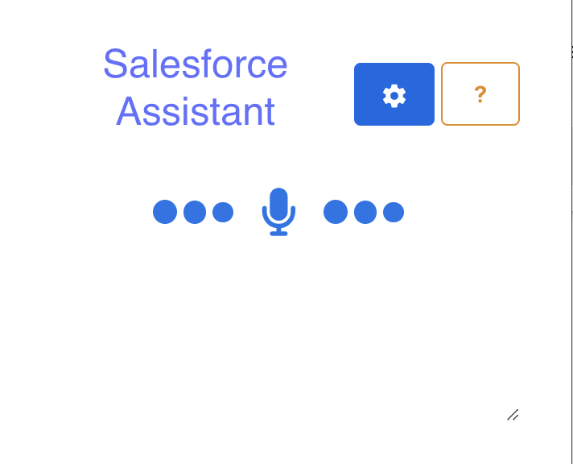
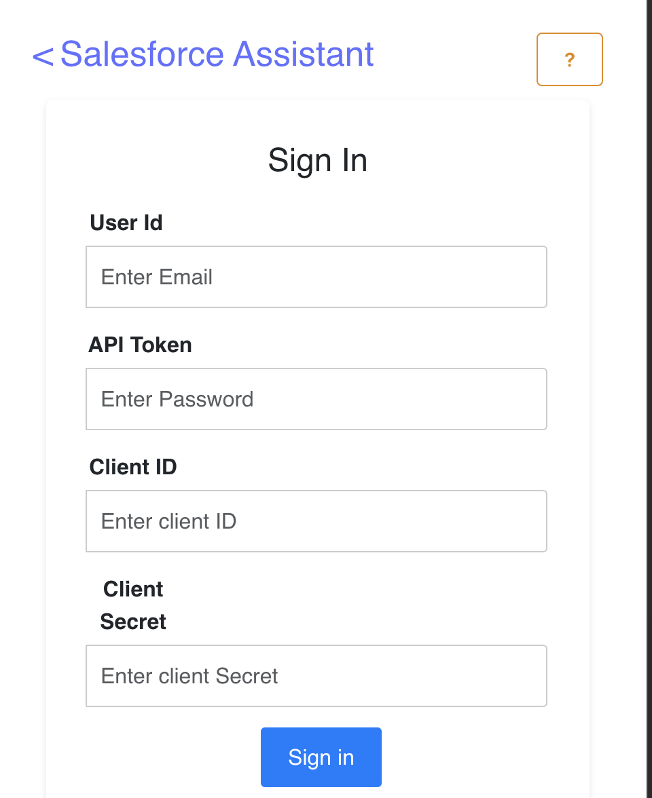

<h1>SALESFORCE VOICE ASSISTANT</h1>

<h3>Boost your Salesforce Case Workflow with Voice Commands!</h3>

Introducing the Salesforce Voice Command extension for Chrome, your one-stop solution for managing cases in Salesforce with just your voice!

This extension empowers you to streamline your workflow and increase productivity by controlling Salesforce Case flow through voice commands. Here's what you can achieve:

<ul>
<li><b>Effortlessly Add Comments:</b>  Simply speak your comment details, and the extension will create a new case comment in Salesforce.</li>
<li><b>Seamless Case Updates:</b> Need to modify the status on an existing case? No problem! Use voice commands to update the status.</li>
</ul>

<b>Increase Efficiency and Stay on Top of Your Workload</b>

This extension is perfect for busy professionals who want to save time and effort managing their Salesforce cases. With voice commands, you can stay focused and get things done without ever needing to switch between windows or applications.

<h3>Demo Video of the Salesforce Voice Assistant</h3>

<h4>Preview of the Tool</h4>

<table border="0">
 <tr>
    <td></td>
 </tr>
</table>

<section class="how-to-use">
                <h4>How to Use:</h4>
                <ol>
                    <li>
                        Login using your Salesforce credentials in the Settings section:
                        <ul>
                            <li><b>User Id:</b> Salesforce User Id</li>
                            <li><b>API Token:</b> You Salesforce User Name appended with Security token. You can get information of how to generate your token <a href="https://help.salesforce.com/s/articleView?id=xcloud.user_security_token.htm&type=5" target="_blank">here</a>.</li>
                            <li><b>Client Id:</b> Your Salesforce Connected App Client Id. If you do not have one, please reach out to your Admin</li>
                            <li><b>Client Secret:</b> Your Salesforce Connected App Client Id. If you do not have one, please reach out to your Admin</li>
                        </ul>
                    </li>
                    <li>
                        Grant Permissions:
                        <ul>
                            <li>In Chrome extension site settings, Provide access to microphone for the extension</li>
                            <li>Granting these permissions is necessary for the extension to function properly.</li>
                        </ul>
                    </li>
                    <li>
                        Classes Required in your Salesforce org:
                        <ul>
                            <li>In your Salesforce org, upload the two Apex classes available <a href="https://github.com/Beavan1997/sf-voice-assistant/tree/main/apexClasses" target="_blank">here</a></li>
                        </ul>
                    </li>
                    <li>
                        Use Voice Commands:
                        <ul>
                            <li>The extension utilizes voice recognition to understand your commands.</li>
                            <li>Here are the specific phrases you can use for each action:</li>
                        </ul>
                    </li>
                </ol>
            </section>

  
<section class="how-to-use">
                <h4>Supported Actions:</h4>
                <ul class="supported-actions">
                    <li><b>Update Case Status:</b> Updates the Status on the Case Record.</li>
                    <li><b>Add Case Comment:</b> Adds a new comment on the Case Record.</li>
                </ul>
            </section>

<section class="how-to-use">
                <h4>Voice Commands:</h4>
                <ul>
                    <li><b>Update Case Status:</b> On Case Number {'<'}CASE NUMBER{'>'} <i>Update</i> status to {'<'}STATUS{'>'}</li>
                    <li><b>Add Case Comment:</b> On Case Number {'<'}CASE NUMBER{'>'} <i>Add</i> comment {'<'}COMMENT{'>'}</li>
                </ul>
                <h4>Alternate Keywords:</h4>
                <h6>The below keywords can be used in place of <i>Keywords</i> above as alternatives to perform the mentioned operations</h6>
                <ul>
                    <li><b>Update Case Status:</b> Update, Set, Change, Alter, Modify, Edit, Correct, Make</li>
                    <li><b>Add Case Comment:</b> Create, Insert, Add, Implement, Generate, Compose, Form, Formulate, Setup</li>
                </ul>
            </section>
